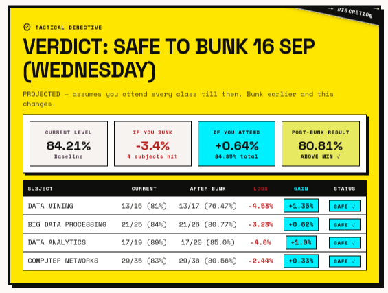

# Bunk Meter 

Why attend when you bunk..

## Demo Video

https://github.com/user-attachments/assets/87ad2284-b944-410e-bd07-9adb65b4c65c

## Basic Details
### Team Name: Bunk Masters

### Team Members
- Team Lead: Minhaj Noushad - Christ College of Engineering, Irinjalakuda
- Member 2: Alvi A V - Christ College of Engineering, Irinjalakuda

### Project Description
A brutally honest dashboard that connects to the college ERP (ETLAB) and calculates exactly how many classes you can skip before your attendance drops below the 75% safety net. 

### The Problem (that doesn't exist)
College students desperately needing to know the *exact mathematical limit* of how many days they can "bunk" without getting detained, because manually calculating attendance percentages is simply too much work.

### The Solution (that nobody asked for)
A fully-featured dashboard that automatically scrapes the college portal, maps subjects intelligently, caches results in a local database, and runs forward-looking simulations to provide a giant "DO NOT BUNK" or "SAFE TO BUNK" verdict.

## Technical Details
### Technologies/Components Used
For Software:
- Python
- Flask (Server & Routing)
- Playwright / Selenium (Headless Scraping)
- SQLite (Caching & User Sessions)
- Tailwind CSS (Styling)

### Implementation
For Software:

# Installation
```bash
# Clone the repository
git clone https://github.com/your-username/bunk-meter.git
cd bunk-meter

# Create a virtual environment
python3 -m venv venv
source venv/bin/activate

# Install dependencies
pip install -r requirements.txt

# Install Playwright browsers (if using playwright fallback)
playwright install chromium
```

# Run
```bash
python app.py
``

# Screenshots





